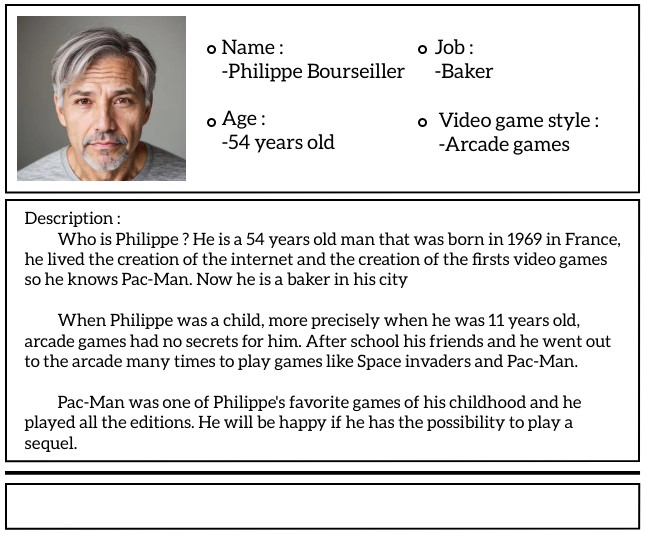
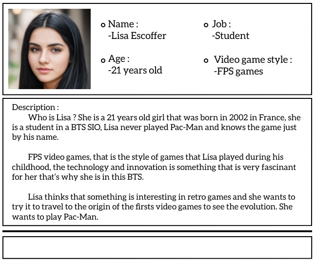
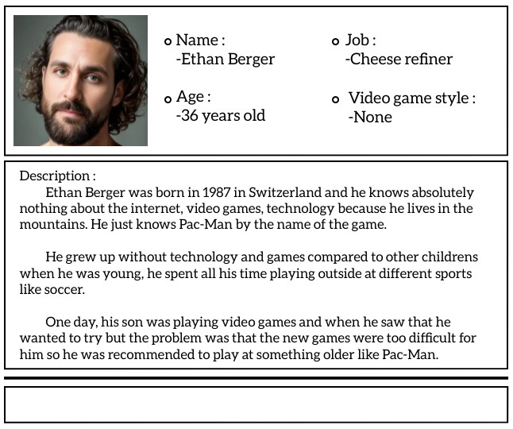

# 2023-2024 - PROJECT-2 - x86-RETROGAMING - TEAM - 8
## Functional Specifications

📖 Table of content

- [2023-2024 - PROJECT-2 - x86-RETROGAMING - TEAM - 8](#2023-2024---project-2---x86-retrogaming---team---8)
  - [Functional Specifications](#functional-specifications)
    - [**1. Introduction:**](#1-introduction)
    - [**2. Project Overview**](#2-project-overview)
      - [**3. Personas \& Use Case**](#3-personas--use-case)
      - [**4. Functionality**](#4-functionality)
      - [**5. Milestones**](#5-milestones)
      - [**6. Interfaces**](#6-interfaces)
      - [**7. Risk \& Assumption**](#7-risk--assumption)
      - [**8. Non Functional**](#8-non-functional)
      - [**9. Evaluation criteria**](#9-evaluation-criteria)
      - [**10. Conclusion**](#10-conclusion)
    - [**References**](#references)
    - [**Glossary**](#glossary)

### **1. Introduction:**
- **Brief history of Pac-man:**

    Pac-Man is a game that was <ins>created by Namco and directed by Toru Iwatani.</ins> The project started in the 1970s and was implemented in an arcade in 1980 with the name of <ins>“Puck Man”.</ins> Then the name of the game was changed for the one we all know nowaday when it was imported into the US, after that Pac-Man started to become popular and more than 100 000 units was sold. In 1981 in US it was the turn of Ms. Pac-Man which is the same that de precedent game but with a feminine character and an alternating maze design system. Next in 1982 is Super Pac-Man that was created in Japan it goal was the same but with some differences because the main character has to eat keys to open doors and then eat fruits that was behind. After that, many pac-man games were created and for some of them they were re-adapted over the years.

    
  
- **Description of Pac-man as a game:**

    It can be a wrong question but we need to know “What is Pac-Man ?”. This video game is an arcade game with simple rules. We have a main character named “Pac-Man” that refer  to an image of a pizza with a slice removed and ghosts who are the enemies of the main character. Pac-Man's gameplay is centered on strategy and quick reflexes. Players must navigate the maze and avoid the ghosts, each of which has its own pursuit pattern. Then the player needs eating every little cube without being touched by the ghosts to have an access to the next level. However, there’s are specific cube that is bigger than the other, this cube allow Pac-man to attack the ghost and take them out for a short time and giving points for a better score and to have access to the next level.

### **2. Project Overview**

- **1. Project Scope:**
We've been tasked by ALGOSUP to undertake a project that must be completed within a tight two-month deadline. The primary goal of this project is to recreate the classic game Pac-Man while paying meticulous attention to replicating its visual representation just as it appeared on its original release date, which was May 22, 1980.
- **2. Objective:**
Reproduce the game pacman in assembly programming language, Keeping it old visual graphics, that is in the year it was published 1980.

- Replicate classic Pac-Man in x86 processor.
- Enhance randomness and scores system.
- Add some new features.
- The program should be run and executed on DosBox.
- Should be completed within 2 months.

#### **3. Personas & Use Case**

##### Use Case:
##### Title: Play Pac-Man Game

##### Actors: Player

##### Goals:
- Moving Pac-Man through the maze.
- Eat the food to score points.
- Run away from ghosts to stay alive.
- Clear the entire maze.

##### Main Success Scenario:

###### Initiation:
The player launch Pac-Man.

###### Maze Setup:
The program loads the game maze with foods and ghosts.

Pac-Man appears in a precise starting position.

###### Player Movement:
The player uses arrow keys to move Pac-Man with the following functions : up, down, left, or right.

Pac-Man's position is updated accordingly.

###### Eat Foods:
As Pac-Man moves, it consumes pellets in its path.
Each pellet eaten contributes to the player's score.

###### Avoid Ghosts:
The player must move Pac-Man everytime to avoid contact with ghosts.
If Pac-Man collides with a ghost, the player loses a life.

###### Power Pellets:
When Pac-Man eats a power pellet, the ghosts turn blue. That indicate their vulnerability for a short time.
Pac-Man can now eat the vulnerable ghosts for additional points.

###### Clearing the Maze:
The player continues navigating Pac-Man through the maze, eating foods, and avoiding ghosts.
The game level is considered complete when all the food is consumed.

###### Level Completion:
If the player clears the entire maze, they will be redirected to the next level.
The system resets the maze, increases the game difficulty, and awards bonus points.

###### Game Over:
If Pac-Man loses all lives (due to ghost collisions), the game ends.
The system displays the player's final score and offers an option to restart or exit the game.

###### Score:
- Every 10 000 points the player earn an extra life

###### Preconditions:
- The game software is properly installed and functioning.
- The player has launched the Pac-Man game.

###### Postconditions:
- The player has completed a game level and earned points.
- The game is ready for the next level or has ended with the player's final score displayed.

#### **4. Functionality**

- *Better randomness*:
  - Improve of the ghost movement algorithm and their different modes:
    - Chase → A ghost’s objective in chase mode, is to find and capture Pac-Man by hunting him.
    - Scatter → In scatter mode the ghost give up the chase for a few second and head for their respective home corners. It’s a brief rest soon, they will revert to chase mode and be after Pac-Man again.
    - Rightened → Ghosts enter frightened mode whenever Pac-Man eats one of the four energizers located in the far corners of the maze.
    

    
    

- *Adding More Mechanics*:
  - Adding a limited two times score bonus.

- *Difficulties levels*:
  - Adding different difficulties levels "Easy, Normal and Hard", like harder maze for a faster gameplay.

- *Score management*:
  - Calculate the score depending on the items the player takes.

- *High scores*:
  - Placing the high score on the top of the screen during the game is part of the new feature to be implemented in case deadlines are not meeting.

- *Sounds and music*:
  - Add the sound effect of the original Pacman and add remixed music addapted for the 8bit system.
    <figure>
    <audio controls>
    <source src="Intro.mp3" type="audio/mp3">
    </audio>
    <figcaption>Click play to hear the sound "Intro".</figcaption>
    </figure>

    <figure>
    <audio controls>
    <source src="Ghost.mp3" type="audio/mp3">
    </audio>
    <figcaption>Click play to hear the sound "Ghost".</figcaption>
    </figure>

    <figure>
    <audio controls>
    <source src="Fruit.mp3" type="audio/mp3">
    </audio>
    <figcaption>Click play to hear the sound "Fruit".</figcaption>
    </figure>

    <figure>
    <audio controls>
    <source src="Extra.mp3" type="audio/mp3">
    Your browser does not support the audio element.
    </audio>
    <figcaption>Click play to hear the sound "Extra".</figcaption>
    </figure>

    <figure>
    <audio controls>
    <source src="Death.mp3" type="audio/mp3">
    </audio>
    <figcaption>Click play to hear the sound "Death".</figcaption>
    </figure>

    <figure>
    <audio controls>
    <source src="Cutscene.mp3" type="audio/mp3">
    </audio>
    <figcaption>Click play to hear the sound "Cutscene".</figcaption>
    </figure>

    <figure>
    <audio controls>
    <source src="Chomp.mp3" type="audio/mp3">
    </audio>
    <figcaption>Click play to hear the sound "Chomp".</figcaption>
    </figure>

-   *Identity*: 
    - Display a text box that allow the player to place in his name, before starting the game.

#### **5. Milestones**

- Deadlines:

|Dates | Time | Deliverables|
| :---:| :---:| :---:|
|11-13-23 | 1.30pm | Functional specification deadline|
|11-27-23 | 1.30pm | Technical specification deadline|
|12-08-23 | 5pm | Test plan deadline|
|12-11-23 | 5pm | Working prototype deadline|
|12-21-23 | 5pm | Final product deadline|

#### **6. Interfaces**

- *Graphical User Interface (GUI)*:
  - The code will be executed and will run on DosBox.

- *Menu System*:
  - At the beginning of the game a Menu option should be displaying, showing information like start and Option.
   
- *HUD (Heads-Up Display)*:
  - Information such as the player's score, lives remaining, and level number should be displaying on the screen during the gameplay process.

- *Gameplay Mechanics*:
  - We should have a top-down view perspective, which is 2D view.

#### **7. Risk & Assumption**

**Risks:**

- *Technical Risks*:
  - Some potential technical challenges related to x86 assembly programming and DOSBox compatibility. For example, difficulties in optimizing performance or handling low-level hardware interactions.

- *Scope Risks*:
  - Risk of feature creep, where additional features or requirements may be introduced during the project, potentially affecting the project's timeline.

- *Testing Risks*:
  - Potential challenges in testing the game, especially in an emulator environment, and the need for thorough quality assurance.

- *Performance Risks*:
  - We have to consider the risk of performance bottlenecks or slow gameplay on less powerful systems when running in DOSBox.

- *Legal and Intellectual Property Risks*:
  - Before publishing the game, we have to consider the copyright issues related to Pac-Man's intellectual property.

**Assumptions:**

- *Hardware and Software Assumptions*:
  - We will create a Package that contain all necessary files that will be needed to run the game in DOSBox no matter the system.

- *Project Timeline Assumptions*:
    - Understanding the Assembly programing language (1 week):
Spend focused time studying the programing language and understand how it works, more precisely x86 processor.

    - Planning and Design (1 week):
Quickly outline the key components and design the structure of your assembly implementation.

    - Setting Up Development Environment (1 week):
Swiftly set up your assembly development environment, ensuring it's ready for coding.

    - Game Loop, Basic Graphics and prototype (1-2 weeks):
Prioritize implementing the core game loop and basic graphics. Focus on displaying the maze and Pac-Man and completed prototype.

    - Input Handling and Minimal Collision (1 week):
Implement basic input handling for Pac-Man's movement and minimal collision detection.

    - Testing and Debugging (1 week):
Start testing early and debug as you go. Identify major issues and fix them promptly.

    - Finalization and Documentation (1 week):
Wrap up the project, make sure everything works, and document your code. Prepare a simple readme file.

- *Resource Assumptions*:
    - Use project planning tools or documents to outline your project's scope and tasks.
    - Consider using collaboration tools for communication and sharing resources.
    - Find or create simple sound effects for eating pellets, movement, and other game events.
    - Online documentation: Access relevant documentation for your chosen assembly language.
    - Assembly language tutorials: Utilize tutorials and guides to enhance your understanding.
    - Choose a suitable assembly language and set up the necessary tools for coding (NASM for x86 assembly).

- *Emulator Assumptions*:
  - Use the more previous version of DOSBox for it new features, and latest improvement.

- *Testing Assumptions*:
  - Create test case for each function to ensure the program works properly
  - Unit test will be conducted for independent components, such as the game loop, input handling, and collision detection.

- *Game Design Assumptions*:
    - The primary goal is to preserve the classic Pac-Man gameplay experience.
    - The focus will be on a single-player experience without incorporating multiplayer features.
    - Player input will be limited to keyboard controls to simplify development.
    - A straightforward scoring system will be implemented without complex scoring mechanics.

#### **8. Non Functional**
1. Performance Requirements:

    - Response Time: The input is very reactive and fast, immediately as the user initiate an action.
    - Frame Rate: The game needs a minimum frame rate of 60fps.
    - Loading Time: The game has to be very fast when loading a short time delay during loading and game starting.

2. Compatibility:

    - The game doesn't have any platform or system preference, run smoothly on all system.

3. Documentation:

    - The functional and technical documents will be required by developers to work out on the project.
    - A useful user manual provided for end user to enjoy complete detail on how the game function and how to play it.

4. Performance on Low-End Systems:
    - The game should properly work on all type of system in terms of performance, whether high or low performance.

#### **9. Evaluation criteria**
- The game has to be entertaining as much as possible.
- Evaluate the graphic visual Design and audio of the game.
- No crash detected during the gameplay session.
- Reasonnable level, No impossible level.
- New features added.
- Speed of the Game.
- All functionalities present and well presented.
- The game has to satisfy those who are playing "User" and the customer.
- Robustness of the program.

#### **10. Conclusion**
To conclude, the game has to be significant, entertaining, and presentable, and should be completed within 2 months.

### **References**
Pacman Game: [Pacman](https://www.google.com/url?sa=t&rct=j&q=&esrc=s&source=web&cd=&ved=2ahUKEwiVy9nDq7WCAxVfTKQEHcjlCi8QFnoECBAQAQ&url=https%3A%2F%2Fwww.toupty.com%2Fjeupacman.html&usg=AOvVaw3lMU2cnWuQpaJqkbbFAaC9&opi=89978449)

Pacman Document: [Information](https://www.google.com/url?sa=t&rct=j&q=&esrc=s&source=web&cd=&ved=2ahUKEwjpkuTLq7WCAxWqcKQEHfsQAM0QFnoECBoQAQ&url=https%3A%2F%2Ffr.wikipedia.org%2Fwiki%2FPac-Man&usg=AOvVaw3O0OVSvLfHCNk6uyz-t3IL&opi=89978449)

### **Glossary**

HUD In video gaming, the HUD (heads-up display) or status bar is the method by which information is visually relayed to the player as part of a game's user interface. It takes its name from the head-up displays used in modern aircraft.

Fruits: There qre different types of fruits in pac-man.
