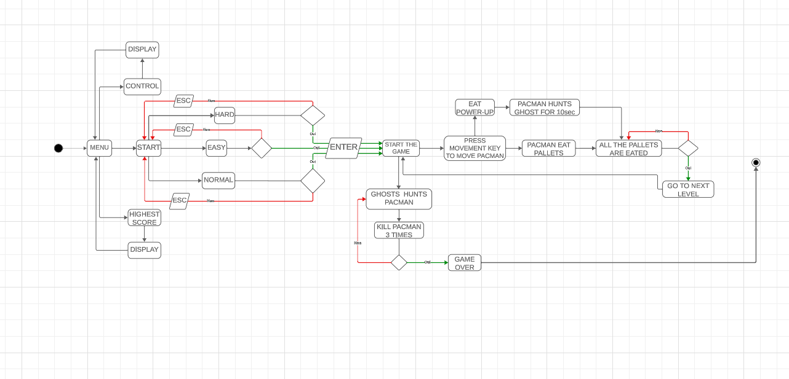
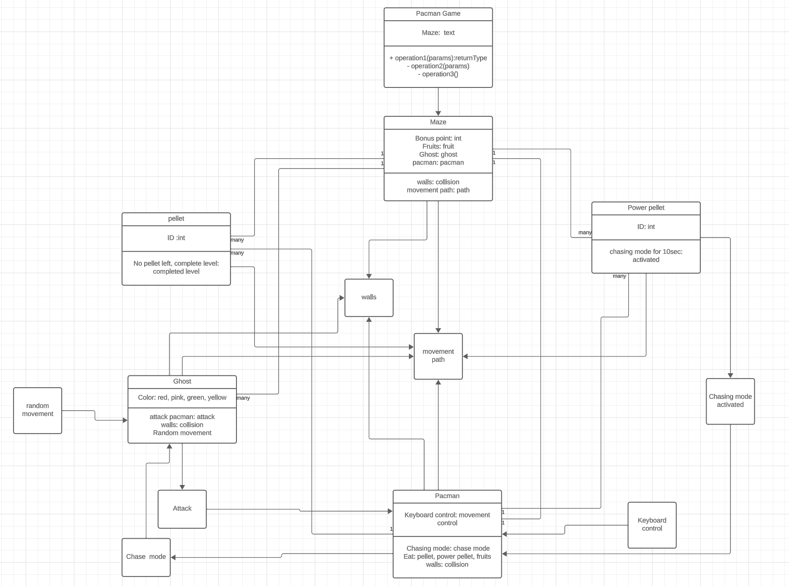
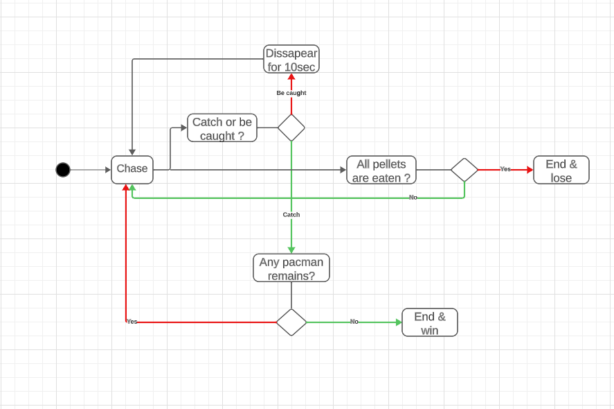

# 2023-2024 - PROJECT-2 - x86-RETROGAMING - TEAM - 8
## Technical Specification

📖 Table of content

- [2023-2024 - PROJECT-2 - x86-RETROGAMING - TEAM - 8](#2023-2024---project-2---x86-retrogaming---team---8)
  - [Technical Specification](#technical-specification)
  - [1. Introduction](#1-introduction)
    - [A. Overview, Problem Description, Summary, or Abstract](#a-overview-problem-description-summary-or-abstract)
    - [B. Glossary or Terminology](#b-glossary-or-terminology)
    - [C. Functional and Technical Requirements](#c-functional-and-technical-requirements)
    - [D. Non-Goals or Out of Scope](#d-non-goals-or-out-of-scope)
    - [E. Future Goals](#e-future-goals)
    - [F. Assumptions](#f-assumptions)
  - [2. Solutions](#2-solutions)
    - [A. Architecture and Tools](#a-architecture-and-tools)
    - [B. Game Loop](#b-game-loop)
    - [C. Game Components](#c-game-components)
      - [a. Game Board:](#a-game-board)
      - [b. user Input:](#b-user-input)
      - [c. Game Logic:](#c-game-logic)
      - [d. Score and lives](#d-score-and-lives)
      - [e. Game Over and Win Conditions:](#e-game-over-and-win-conditions)
    - [D. Debugging and Testing​](#d-debugging-and-testing)
    - [E. Documentation](#e-documentation)
    - [F. Future Enhancements](#f-future-enhancements)
  - [3. Further Considerations](#3-further-considerations)
    - [A. Third-party services and platforms considerations](#a-third-party-services-and-platforms-considerations)
    - [B. Security considerations](#b-security-considerations)
    - [C. Risks](#c-risks)

| | |
| ----- | ----- |
| **Title :** | Technical Specification x86-RETROGAMING |
| **Author :** | Tsangue Choungou Vivien Bistrel|
| **Team :** | Team 8 |
| **Reviewer :** | ALGOSUP |
| **Created on :** | 14/11/2023 |
| **Last updated :** | 27/11/2023 |
​
## 1. Introduction
​
### A. Overview, Problem Description, Summary, or Abstract

ALGOSUP entrusted us with the realization of a project which must be completed within a tight deadline of 7 weeks. The main objective of this project is to recreate the classic Pac-Man game by reproducing its visual representation as it appeared on its original release date, May 22, 1980.

The game must be reproduced in the x86 processor assembly programming language, keeping in mind that its visual representation must be similar to that of its original release date.
### B. Glossary or Terminology

| | |
| ----- | ----- |
| **Abstract words** | **Meaning** |
| x86 processor | The x86 processor is like the brain of a computer. It's a type of technology that helps computers do their jobs. Here are some key points.|
| NASM | NASM (Netwide Assembler) is an assembly language compiler for the x86 architecture that convert assembly code into machine code. |
| DOSbox | DOSBox is an x86 emulator with DOS (Disk Operating System) that allows users to run software and games developed for MS-DOS on modern computer systems. |
| ASCII | ASCII, which stands for American Standard Code for Information Interchange, is a character encoding standard that represents text characters in computers and other devices that use text.|
| DOS emulator | A DOS emulator is a software application that allows a computer to run programs designed for the Disk Operating System (DOS), which was a popular operating system used in the early days of personal computing. |
| Mnemonics| Mnemonics refer to the symbolic names used to represent machine-level instructions. |
| Mimic |  Staying in the project concept, it means to imitate or reproduce the characteristics, behavior, or functionality of specific DOS versions. |

### C. Functional and Technical Requirements
​
**[a. Functional specification:](https://github.com/algosup/2023-2024-project-2-x86-retrogaming-team-8/blob/main/Documents/Specifications/Functional%20specifications.md)**
- This provides you with all the necessary information to have a global view of the client's needs.

**b. Technical requirements**

- ***Functionality:***
  - Reproduce the game Pacman in assembly programming language and add some new features. The primary objective and most crucial one is to make the exact Pacman game, and then,within the time frame, with time not knocking at our door, we add new features to the game.

- ***Compatibility:***
  - The game must be compatible with all system, with no system preference(Linux, MacOS, Windows).

- ***Usability:***
  - The game must be user-friendly and intuitive, a clean and clear User interface(UI) and User experience(UX) to ensure an effective and efficient interaction for the user.

  - At the level of the User interface, for the layout and navigation, specify the arrangement of elements on the screen and how users navigate through the interface. This includes menu(Start, High Score, Settings, Quit), navigation buttons for the movements.

  - At the level of the User experience, for the efficiency part, define expectations regarding the efficiency of user interactions. This includes minimizing the number of steps needed to accomplish tasks.

### D. Non-Goals or Out of Scope

- ***Network Multiplayer:***
  - Designing the game for multiplayer functionality like battle game competition, network play, and local play.

- ***Advanced Graphics Effects:***
  - Implementing complex graphics effects beyond the basic requirements, such as advanced shaders or particle effects.

- ***Uploading:***
  - Upload the game online for people to play it.

- ***Cross-Platform Compatibility:***
  - The focus is solely on developing the game for a specific platform, and efforts to make it compatible with other platforms.

### E. Future Goals

- ***Enhanced ghost movement:***
  - Integrate more sophisticated algorithms to improve the behavior of ghosts in the game and their movements.

- ***Additional Levels:***
  - Currently, the game will be designed with single levels, and future goals will involve adding more levels to increase complexity.

- ***Sound Effects and Music:***
  - Implementing sound effects and background music could be considered for a future iteration of the game.

- ***Choose the difficulty level:***
  - Implementation of a tree difficulty level so that the user has a choice based on his/her performance (Easy, Normal, Hard).

- ***Difficulties level:***
  - Currently, a simple basic-level Pacman game will be produced, and the other levels of difficulty will be considered as feature goals.
​
### F. Assumptions

- ***Development Environment:***
  - The development environment includes a suitable x86 assembler and compiler configured for the target architecture.

- ***Hardware Resources:***
  - The target systems for running the Pacman game have sufficient hardware resources (CPU, memory) to execute the assembly code efficiently.​

- ***Scoring System:***
  - A scoring system where points are awarded for each pellet consumed, and additional points are earned for eating power-ups and capturing ghosts.

- ***Lives System:***
  - The implementation of a life system for Pac-Man. Pac-Man loses a life when captured by a ghost and can gain extra lives based on the score

- ***Winning and Losing Conditions:***
  - Assume the game continues until Pac-Man loses all lives or completes a predefined number of levels.

- ***Game Over Screen:***
  - A game over screen that displays the final score and prompts the player to restart or exit the game.

- ***Input Devices:***
  - Standard input devices, such as a keyboard, are assumed to be available for user interaction with the Pacman game.

- ***Compatibility with x86 Instruction Set:***
  - The assembly code is compatible with the x86 instruction set without reliance on architecture-specific features that might vary between processors.

- ***Development Tools:***
  - Adequate development tools, including debuggers and profilers compatible with the x86 assembly language that makes use of mnemonics to write the code, are available for troubleshooting and optimization.

  - NASM, an x86 architecture renowned for its portability, is used as an assembler.

- ***Execution and debugger environment***
  - DOSbox x86 assembler emulator, is used to execute and debug the software program.

## 2. Solutions
​
### A. Architecture and Tools
Because the game has already been created in all sorts of languages, to make this project innovative, we are going to use assembly language for this project, NASM will be used as assembler to make it unique, and DOSbox will be needed.

- ***Assembly Language:***
  - Closer to machine language and very effective because it directly helps us manipulate computer components, it also uses a human-readable programming language and uses mnemonics to represent machine instructions. It is a low-level programming language.

- ***Assembler:***
  - NASM uses a simple and clear syntax, making it accessible to both beginners and experienced assembly language programmers. The syntax is designed to be similar to Intel-style assembly language, which is commonly used for x86 architecture.NASM is available for multiple platforms, including Windows, Linux, and macOS, making it a cross-platform assembler. This allows developers to write assembly code on one platform and assemble it for another. The latest version of NASM will be used for the project that is "2.16.02rc5", for each platform.

          section .data
          hello db 'Hello, World!', 0

          section .text
          global _start

          _start:
          ; write the string to stdout
          mov eax, 4         ; syscall number for sys_write
          mov ebx, 1         ; file descriptor 1 is stdout
          mov ecx, hello     ; pointer to the string
          mov edx, 13        ; length of the string
          int 0x80           ; interrupt to invoke the kernel

          ; exit the program
          mov eax, 1         ; syscall number for sys_exit
          xor ebx, ebx       ; exit code 0
          int 0x80           ; interrupt to invoke the kernel

This code demonstrates a simple program to print out a "Hello, World!", and to save an asssembly program file, we use the extension "**asm**". The software program above is can be saved as Hello.asm.

- ***Plateform:***
The game will be available for multiple platforms, that is, Windows, Linux, and macOS. This allows the users to have access to play the game on any system.

- ***Emulator:***
DOSBox is an open-source, x86 emulator with DOS (Disk Operating System) that allows you to run and debug assembly programming language software and games. It's available for various operating systems, including Windows, Linux, macOS, and others. This cross-platform support allows users to run DOS applications on a wide range of modern machines moreover it emulates the x86 architecture, which was prevalent in the hardware of the MS-DOS era. This allows it to run software that was written for the original x86 processors.

- ***Text Editor/IDE and extensions:***
VS Code and Notepad are IDEs that are widely used for programming assembly languages, but for this project, VS-Code will be suitable because of the extension, which is helpful and eases the work. For example, the extension (NASM x86 syntax highlight), as its name suggests, helps to highlight our code and easily repair each part during debugging, which is much more useful than having everything either in black or white.

### B. Game Loop
Here under is a simple flowchart representation of the game loop, or the gameplay mechanism.

### C. Game Components

#### a. Game Board:
- ***Data Structure:***
  - Represent the game board using 2D arrays. Define the walls, pallets, power-ups, ghosts, and Pac-Man.
For example, here is a simple entity relationship diagram to illustrate what the simple Pacman will look like.

- ***ASCII Characters:***
  - Use simple ASCII characters to represent different elements on the game board. For example, use '@' for Pac-Man, 'G' for ghosts, '.' for pellets, and '#' for walls.

- ***Graphics:***
  - For more advanced graphics, explore DOS graphics interrupts (e.g., INT 10h) to display more detailed and visually appealing sprites for Pac-Man, ghosts, and other game elements.

        game_board db 20, 20 ; 20x20 game board
                   db '###############' ; Wall
                   db '#.............#'
                   db '#.####.####.#.#' ; Example layout
                   db '#.#GG.#.#GG.#.#' ; G represents ghosts
                   db '#.#.##.##.#.#.#'
                   db '#.#.##.##.#.#.#'
                   db '#.#GGGGGGG.#.#' ; Power-ups
                   db '#.#.##.##.#.#.#'
                   db '#.#.##.##.#.#.#'
                   db '#.#GG.#.#GG.#.#'
                   db '#.####.####.#.#'
                   db '#.............#'
                   db '###############'

#### b. user Input:
- ***Keyboard Input:***
  - Use DOS interrupts (e.g., INT 16h) to handle keyboard input. Map specific keys (e.g., arrow keys) for controlling Pac-Man's movement.

- ***Game Loop:***
  - Implement a game loop that continuously checks for user input. Update Pac-Man's position based on the input.

#### c. Game Logic:
- ***Starting the Game:***
  - Define the key-press "Enter" to start a game from the game Menu, select the level of difficulty (Easy, Normal, Hard), and start playing the game

- ***Movement Rules:***
  - Define rules for Pac-Man's movement, ensuring it stays within the boundaries of the game board and reacts appropriately to walls that enable collision, during contact with the wall.

- ***Pac-Man chasing mode:***
  - Implement logic for Pac-Man to activate the chasing mode, lasting for 10 seconds whenever he eats a power-up, making ghosts prey, and him a hunter.

- ***Pellet Consumption:***
 - Implement logic for Pac-Man to consume pellets and power-ups when moving over them. Update the score accordingly.

- ***Ghost Behavior:***
  - Define the behavior of ghosts. For example, make them move randomly or implement more sophisticated AI for chasing Pac-Man.

#### d. Score and lives

- ***Score Display:***
  - Display the player's score on the screen. Update the score each time Pac-Man consumes a pellet or power-up.

In the image above, the score is at the bottom left corner of the screen image the lives are dis at the bottom middle of the screen image, and then finally the level at which the player is is displayed at the bottom right.

- ***Life System:***
  - Implement a life system for Pac-Man. Display the remaining lives on the screen, and decrement the count when Pac-Man is caught by a ghost.
#### e. Game Over and Win Conditions:
- ***Game Over:***
  - End the game when Pac-Man loses all lives. Display a game-over message and allow the player to restart or exit.

- ***Win Conditions:***
  - Implement win conditions, such as advancing to the next level when all pellets are consumed. Increase the difficulty with each level.
​
### D. Debugging and Testing​
- ***DOSbox debugger:***
  - Familiarize yourself with the DOSBox Debugger. Use breakpoints, step-by-step execution, and inspect memory to debug your assembly code effectively.

- ***Testing:***
  - Unit Testing:
  Perform unit testing for individual components, such as Pac-Man movement, collision detection, and scoring logic.
  - Scenario Testing:
  Test the game in different scenarios to ensure it handles various user inputs, collisions, and edge cases robustly.
​
### E. Documentation

- ***Comments:***
  - Detailed comments throughout the code, explaining the purpose of each section, each line, major functions, and any complex algorithms or calculations from scratch to help another software developer.

- ***Readme:***
  - Include clear instructions on how to assemble, run, and play the game using DOSBox.
​
### F. Future Enhancements

- ***Sound effect:***
  - Consider using DOS interrupts (e.g., INT 21h) for simple sound effects to enhance the gaming experience.

        mov ah, 86h     ; Function to play frequency on PC speaker
        mov dx, frequency ; Frequency of the sound
        int 21h         ; Call DOS
      The code above simply shows a simple part of a function needed to play a sound file.

- ***Levels:***
  - Implement multiple levels with increasing difficulty. Design a unique maze for each level.

Current maze:

Next level maze:

- ***Graphics Improvements:***
  - Explore more advanced graphics techniques, such as sprite animation or additional graphics interrupts, for a visually appealing game.​
​
## 3. Further Considerations
​
### A. Third-party services and platforms considerations

- ***Community Support:***
  - Engage with online communities and forums dedicated to x86 Assembly, DOS game development, and related topics. Seek advice, share experiences, and collaborate with other developers. Platforms like Stack Overflow, Reddit, or specialized retro gaming forums can be valuable resources, very useful as you can have feedback from other developers, and they can participate in the accomplishment of the project by guiding you on how to implement a complex function.

- ***Version Control Systems:***
  - Explore third-party version control systems compatible with the **x86 Assembly** development workflow.

### B. Security considerations

- ***Input Validation:***

  - Without sturdy input validation, Pac-Man is susceptible to potential buffer overflows and unsanitized user input.

### C. Risks

- ***Time-Frame:***
  - A good management of time for the project to ensure proper delivery. An unforeseen challenge in assembly during programming will impact the project's initial delivery date.

- ***Compatibility Issues:***
  - Potential compatibility issue with DOS emulator, for example:
    - Emulated graphics and sound may differ from real hardware, leading to graphical glitches or issues with sound playback.
    - Emulators, especially those in active development, may have bugs or incomplete features that impact compatibility.
    - Some DOS emulators offer compatibility modes to **mimic** specific **DOS versions**. However, not all features or behaviors may be accurately replicated.
    - Emulators, especially those in active development, may have bugs or incomplete features that impact compatibility.

- ***Learning Curve:***
  - Acknowledge that learning x86 Assembly may have a steep learning curve, especially if you are new to low-level programming, and this can cause a subsequent delay in the delivery of the overall project. Here is a link that contains all the necessary resources to help new users to have a basic level of assembly programming language, NASM, and DOSbox **[Resources](https://www.notion.so/add5b9314345446ca34c5eb2ad43fd80?v=0107bb6307824d24a8b3d7a507bf34ac&pvs=4)**

- ***Debugging Challenges:***
  - Understand that debugging Assembly code can be challenging. A good part of the time will be invested in debugging and troubleshooting issues that may arise during development.

- ***Project Scope:***
  - Regularly reassess and manage the project scope to avoid feature creep. Clearly define the essential features and functionalities for the initial release, and consider future enhancements separately.