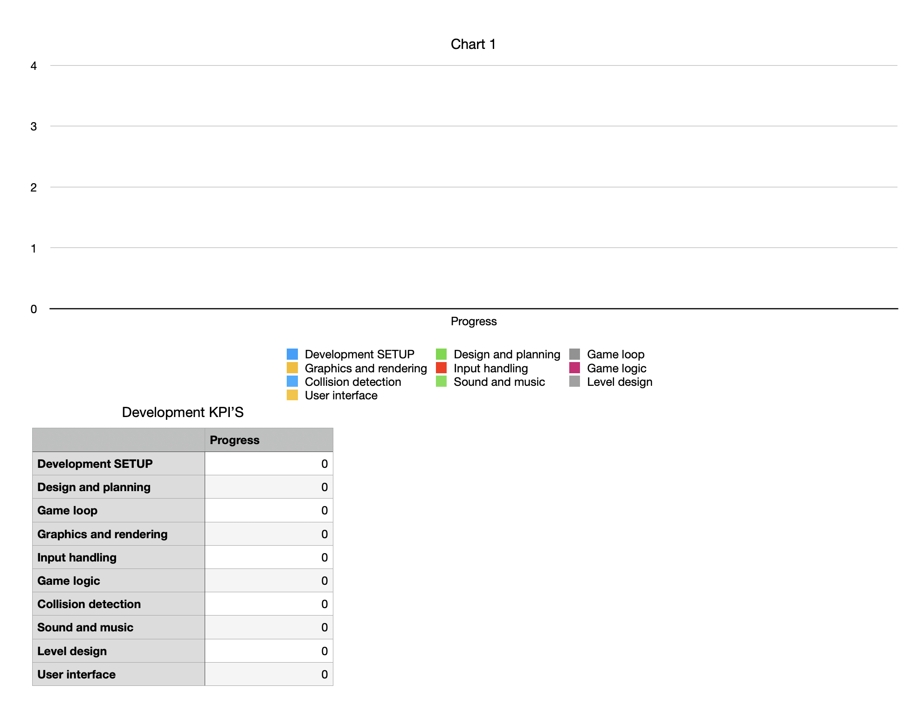
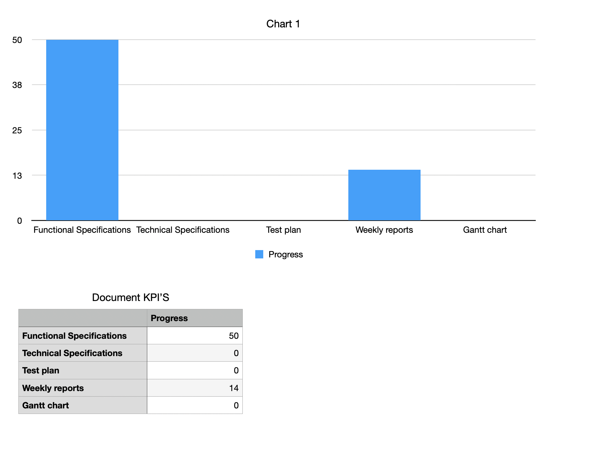
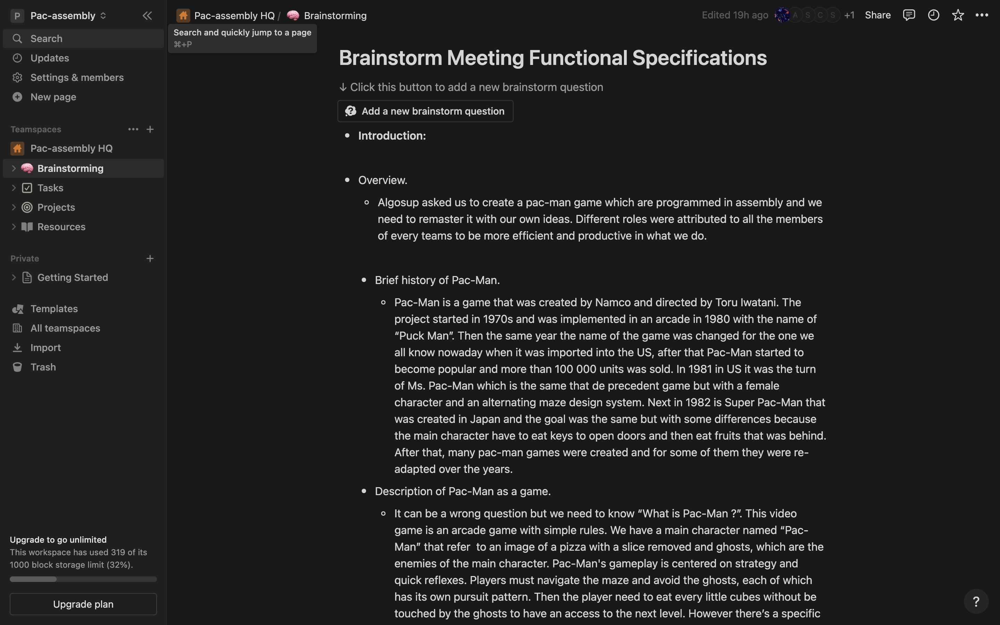

# Weekly Report 1 (Monday 6th-Friday 10th): Assembly Project Progress

## Project Overview

Our focus this week was primarily on the functional aspects of the Pac-Man Assembly project, We have made significant progress on the functional specifications and on the management aspects of the project.

## Technical Achievements

1. **Functional Specifications Milestones:** The functional specifications expected for the beginning of the project have been completed, polishing will be required during the weekend to meet the deadline.

2. **Learning and Skill Development:** Initiatives were taken to bolster the team's knowledge of assembly language. Short tutorials and knowledge-sharing sessions were done via Notion to equip team members with the skills for the project.

## Project Planning and Management

1. **Rough code plan:** A plan for the project was formulated, outlining the roadmap for the upcoming weeks. It contains an analysis of the project scope and identifying possible challenges.
   

2. **KPIs Implementation:** Key Performance Indicators (KPIs) were established to gauge the project's progress and efficiency.
   

3. **Notion created:** A Notion has been created to share our information and to add the resources, the brainstorming and also the tasks for the project.
   

4. **Gantt Chart Creation:** A Gantt Chart is in process of being created to ensure that the tasks are well coordinated and deadlines are met.

## Knowledge Dissemination

1. **Team Training:** Efforts were directed towards sharing knowledge within the team. Introductory sessions on assembly language were conducted to ensure a similar understanding among team members.

2. **Documentation Initiation:** Preliminary documentation, including a project report (this document), was initiated.

## Next Steps

Looking ahead to the upcoming week, the team is poised to transition into the next phase of the project:

1. **Game Development Kickoff:** Half of the team members will commence work on the game development aspect, building upon the functional groundwork laid this week.

2. **Document Preparation:** The other half will shift focus towards creating project documents, including the Test Plan and Technical Specifications.

## Conclusion

In summary, this week has been marked by significant achievements in both the technical and managerial aspects of the Assembly project.
