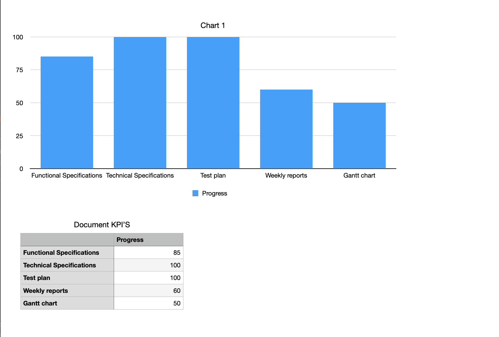
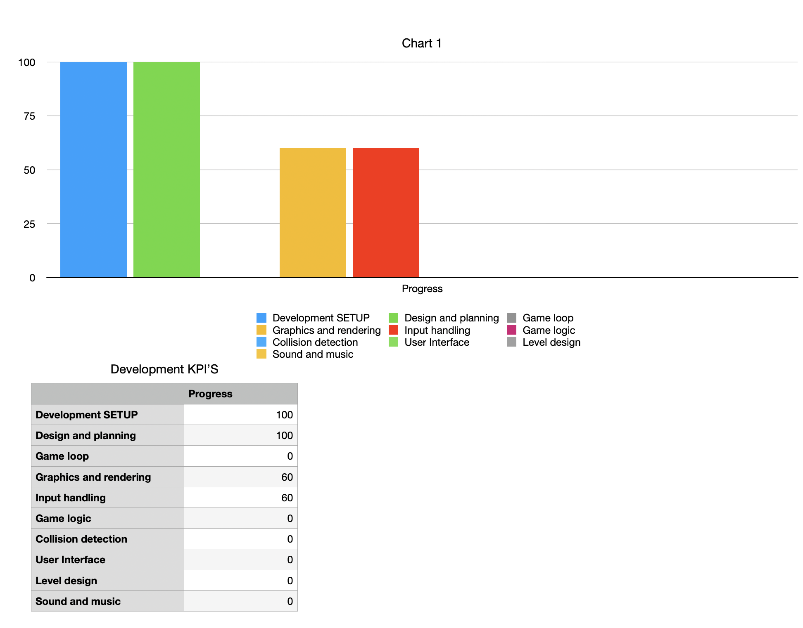

# Weekly Report 4 (Monday 27th-Friday 1st): Assembly Project Progress

## Overview

The focus for this week was primarily on the input handling and the maze. We have been stuck creating these features for the past two weeks; we need to finish these aspects by the end of this week as soon as possible to advance on the collisions and on in the game loop on itself. In terms of Documents, the Test plan is complete.

## Technical Achievements

1. **Game Development:** We are stuck on the input handling and on the creation of the maze; the only thing we have now is a black screen that.

2. **Test plan development:** The QA has completed the test plan; he is now helping on the code to start testing different aspects of the game.

## Project Planning and Management

1. **Game Development Progress:** Because the team has been stuck doing the input handling and graphics, the KPI's (game-related) have not advanced properly as to what was expected for the week; the ones for the documents have advanced nicely.

## Next Steps

Looking ahead to the upcoming week:

1. **Game Development Continuation:** The team will continue with working on the input handling and the rendering, and it has to be completed by the end of the week; after that, we can start working on the game logic and the game loop.

2. **Document Refinement:** The program manager will still be working on the functional specifications to refine them following the received feedback.

## Conclusion

In summary, the fourth week has been a roadblock for our progress; however, we can and we will surmount this period to complete the game.
