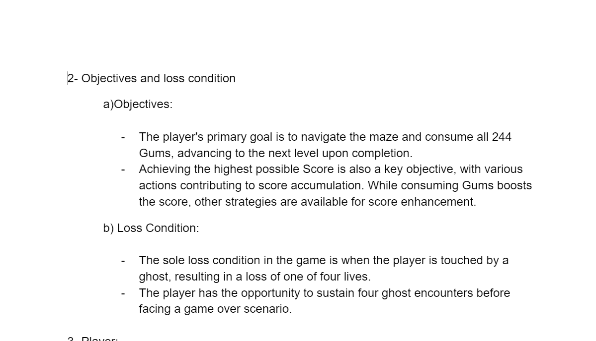
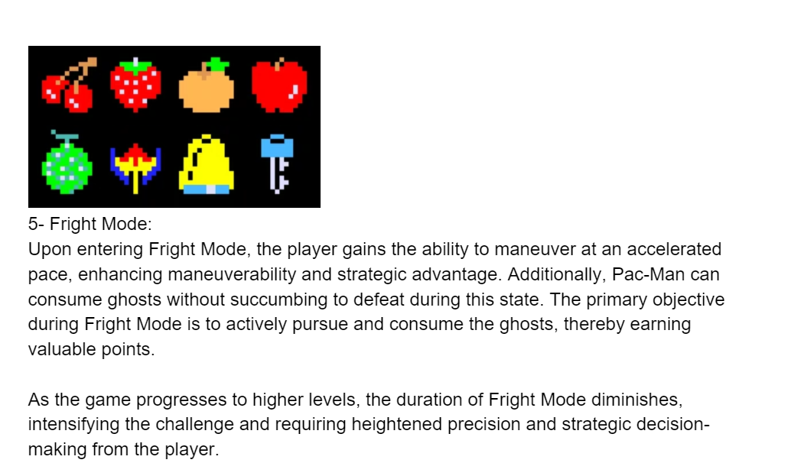
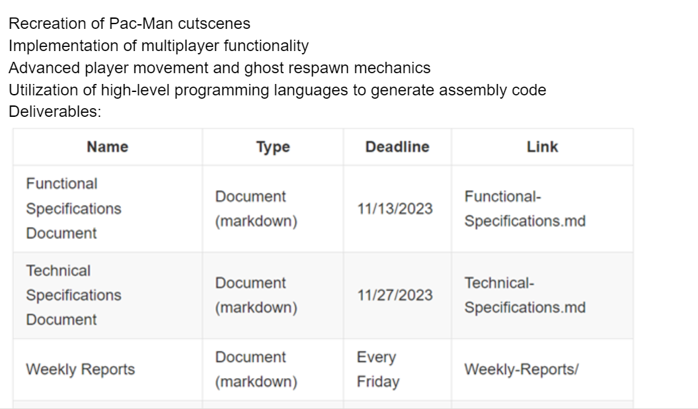
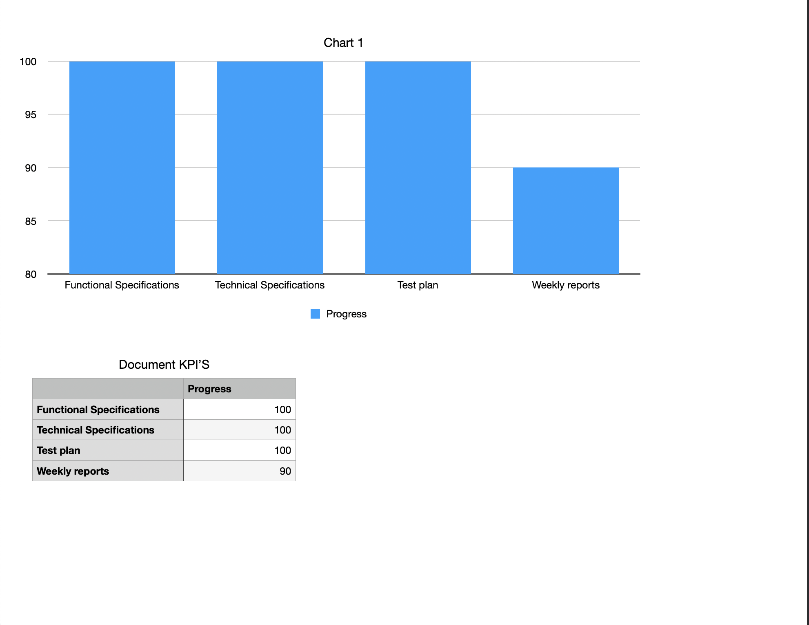
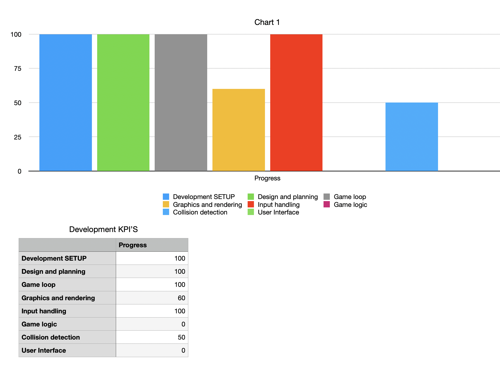

# Weekly Report 6 (Monday 11th-Friday 15th): Assembly Project Progress

## Overview

The focus for this week was mainly on the collisions for the game. We have managed to do the detections of the collisions the work has been mainly on detecting the color of the pixel. We are now working on the function to stop pac-man using the detection.

## Technical Achievements

1. **Game Development:** We have advanced on the collisions, more than half of it is now implemented, what we now require is to link the detection with the movement of Pac-man so that he cannot eat the walls.

2. **Functional development:** The Program manager has finished polishing the functional specifications they are now more in scope towards what we actually have and they are also more detailed.

## Project Planning and Management

1. **Game Development Progress:** The Kpi's have not advanced that much during this week in terms of game development, in terms of documents however we are very close to completion as we are expecting to have them all completed by the end of the next week.

1. **Tasks:** The chart to assign the progress for the week has also been completed on our Notion in reason to that the Gantt chart has been transformed into the tasks they will be addressed in the Notion file.

## Next Steps

Looking ahead to the upcoming week:

1. **Game Development Continuation:** The team will continue finish the collisions and start implementing the rest of the mechanics, the pellets, the ghosts and the user interface.

2. **Delegation of Project manager:** The project manager (David Cuahonte) will be absent for the last week of project, because of that the team decided to delegate the manager role to the program manager (Atifa Amiri) for the last week.

## Conclusion

In summary, the sixth week has seen slow advancement, but we still believe we will be able to deliver what we expected to get at the end of this project period.
