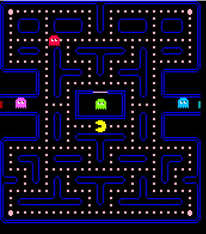
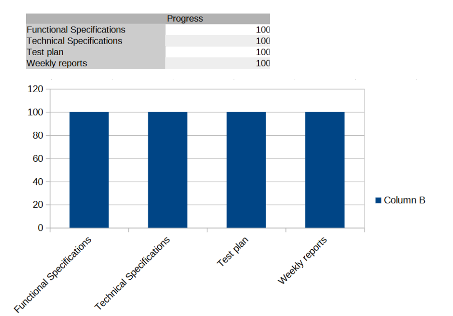
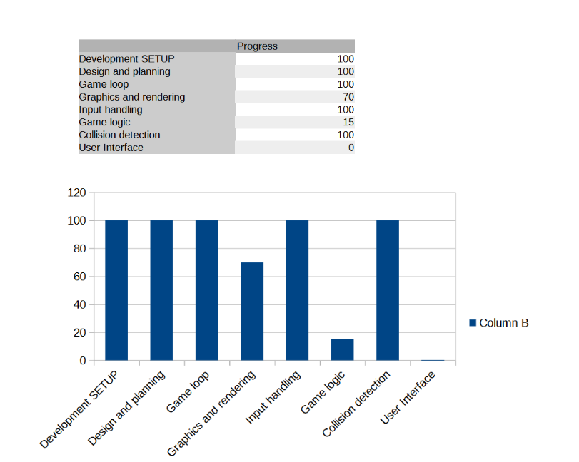

# Weekly Report 7 (Monday 18th-Friday 22nd): Assembly Project Progress

## Overview

The main focus of this week was to prepare the oral presentation but also to finalize the project (Pacman).
We needed to finish the collisions of the game, have the pellets, game bonus, game logic...

## Technical Achievements

1. Collisions: We have successfully made the collisions of the game.

2. Pellets: We have successfully made the pellets and super pellets.

3. Ghosts: We have successfully printed the ghosts.

## Project Planning and Management

1. **Gale Development Progress:** Because the team has managed to finish we have completed the functional specifications
and technical specification and test plan of the game, but some parts of the game was remained for example:
ghost behavior, scoring, bonuses, lighting, and loss conditions, which if we had time in future we will complet.

## Next Steps

This is the end of the 7-weeks project but maybe in the future
for those who want, they can continue the game.

## Conclusion

As we conclude this final project, it is a testament to our dedication, collaboration, and innovation. This endeavor has been a remarkable journey, culminating in a product that embodies our collective effort and passion.
